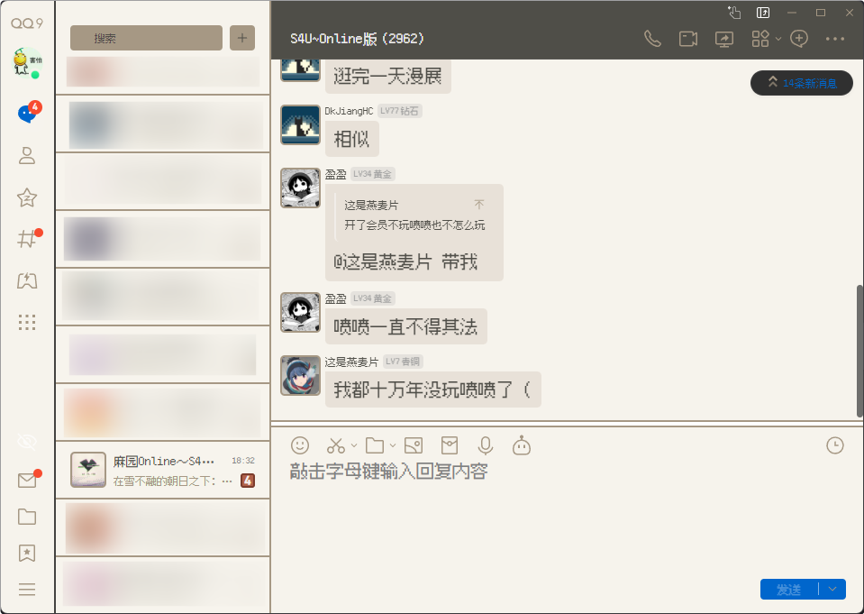

# LiteLoaderQQNT-Theme-S4U

[LiteLoaderQQNT](https://github.com/LiteLoaderQQNT/LiteLoaderQQNT) 的插件，仿造 S4U:都市朋克2011与爱的重拳 制作的主题

> [!NOTE]
> 该插件仅在 Windows 环境下测试开发，未对其他平台进行测试，不保证可用性

> [!CAUTION] > **请不要在 QQ 官方群聊和任何影响力较大的简中互联网平台（包括但不限于: 哔哩哔哩，微博，知乎，抖音等）发布和讨论*任何*与本项目存在相关性的信息**

## 使用方法

1. 安装 **[LiteLoaderQQNT](https://liteloaderqqnt.github.io/)**
1. 从 release 中下载 `LiteLoaderQQNT-Theme-S4U.zip `
1. 将下载的压缩包解压到 LiteLoaderQQNT 的 `plugins` 目录下
1. 重启 QQ

## 注意事项

- 由于我的技术不够，目前如果需要像素字体，需手动到[TakWolf/fusion-pixel-font](https://github.com/TakWolf/fusion-pixel-font)中下载 `fusion-pixel-font-12px-monospaced-ttf-.*.zip` 解压后右键安装其中的 `fusion-pixel-12px-monospaced-zh_hans.ttf`

- **最好不要与其他 LiteLoader 主题同时使用**

- 推荐配合 [hacker-frok/LiteLoaderQQNT-Plugin-Brevity-btn](https://github.com/hacker-frok/LiteLoaderQQNT-Plugin-Brevity-btn) 项目使用视觉效果更佳

## 其他

- 本项目纯娱乐用途，仅供学习交流
- 以及代码仅限于能跑（逃

# 鸣谢

- [SyrieYume/starrail_ui](https://github.com/SyrieYume/starrail_ui)
- [festoney8/LiteLoaderQQNT-Telegram-Theme](https://github.com/festoney8/LiteLoaderQQNT-Telegram-Theme)
- [xiyuesaves/LiteLoaderQQNT-lite_tools](https://github.com/xiyuesaves/LiteLoaderQQNT-lite_tools)
- [festoney8/LiteLoaderQQNT-Theme-Template](https://github.com/festoney8/LiteLoaderQQNT-Theme-Template)
- [ltxhhz/LL-plugin-list-viewer](https://github.com/ltxhhz/LL-plugin-list-viewer)
